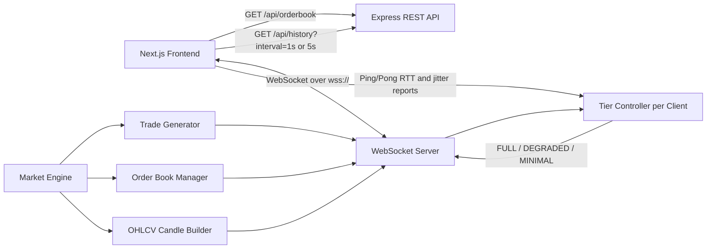
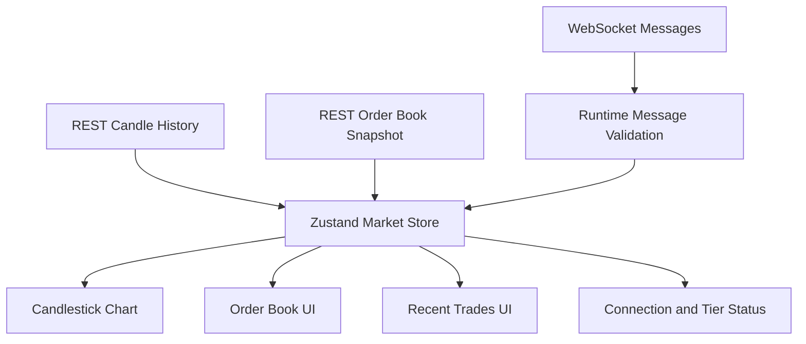
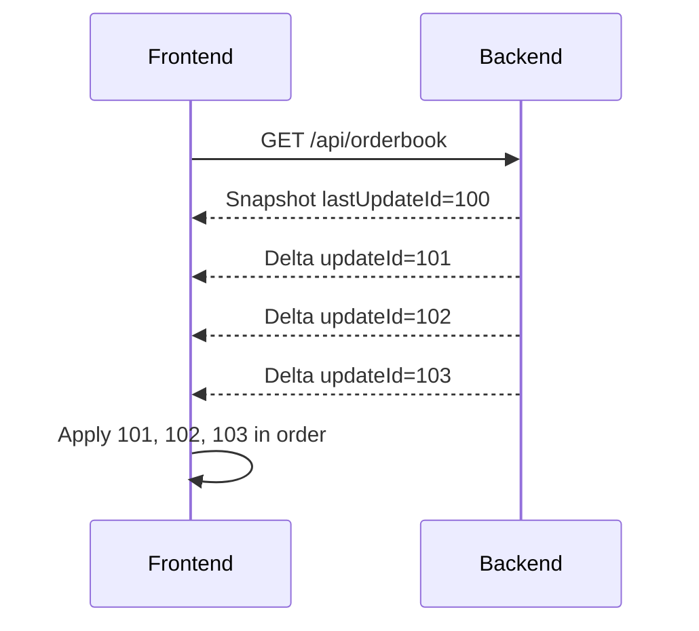
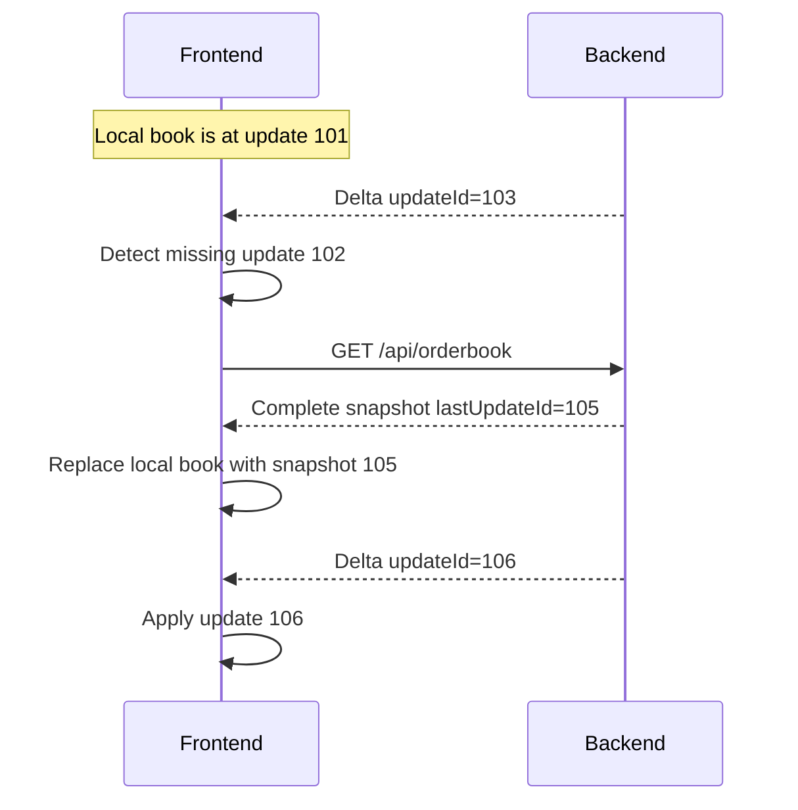

# Web Crypto Market Dashboard

A full-stack real-time cryptocurrency trading dashboard for a simulated BTC/USD market.

The application demonstrates:

- Real-time trades
- Local order-book synchronization
- Historical and live candlestick data
- Adaptive WebSocket delivery tiers
- Latency and jitter measurement
- Reconnection and stale-state handling
- Production deployment with separate frontend and backend services

## Live Deployment

- Frontend: deployed on Vercel
- Backend REST and WebSocket server: deployed on Render

Backend API:

```text
https://web-crypto-app-45xj.onrender.com
```

Backend endpoints:

```text
https://web-crypto-app-45xj.onrender.com/api/orderbook
https://web-crypto-app-45xj.onrender.com/api/history?interval=1s
https://web-crypto-app-45xj.onrender.com/api/history?interval=5s
```

The production WebSocket endpoint uses the same backend hostname:

```text
wss://web-crypto-app-45xj.onrender.com
```

## Architecture

The application is split into two independently deployable services.

### Frontend

The frontend is built with:

- Next.js 16
- React
- TypeScript
- Zustand
- Lightweight Charts
- Tailwind CSS

The frontend is responsible for:

- Rendering the trading dashboard
- Fetching historical candle data
- Maintaining the local order book
- Applying ordered WebSocket updates
- Displaying trades and active candles
- Measuring connection latency and jitter
- Reconnecting after disconnection
- Showing stale data while disconnected or while the browser tab is hidden

### Backend

The backend is built with:

- Node.js
- TypeScript
- Express
- `ws` WebSocket server
- CORS

The backend is responsible for:

- Generating a deterministic simulated market
- Generating trades
- Maintaining the complete order book
- Generating OHLCV candles
- Serving REST snapshots and historical candles
- Broadcasting trades and order-book deltas
- Measuring each client's reported latency
- Assigning a delivery tier independently for every WebSocket client

## Architecture Flow



## Frontend Data Flow



## State Management

The application uses Zustand in:

```text
src/store/useMarketStore.ts
```

Zustand stores:

- Connection status
- Stale/live status
- Current delivery tier
- RTT
- Jitter
- Effective chart update rate
- Local order book
- Last order-book update ID
- Recent trades
- Active 1-second candle
- Active 5-second candle

The store exposes actions for:

- Replacing the order book with a REST snapshot
- Applying one ordered order-book delta
- Adding trades
- Updating active candles
- Updating connection state
- Updating latency statistics
- Updating delivery tier information

The UI components do not own the market-data synchronization logic. They read synchronized state from the Zustand store.

## Generated Market Data

The backend generates a deterministic simulated BTC/USD market.

The market engine:

- Starts around a price of `50000`
- Generates a new trade every `300 ms`
- Gives each trade an increasing numeric ID
- Generates a price, quantity, and timestamp
- Updates the order book around the latest price
- Builds 1-second and 5-second OHLCV candles
- Maintains historical candle arrays in memory

The optional `MARKET_SEED` environment variable controls deterministic generation:

```text
MARKET_SEED=1337
```

If no seed is provided, the default seed is `1337`.

### Trade Format

```json
{
  "id": 123,
  "timestamp": 1791554250000,
  "price": 50004.99,
  "quantity": 1.9822
}
```

### Candle Format

```json
{
  "timestamp": 1791554250000,
  "open": 50000,
  "high": 50011.49,
  "low": 49998.4,
  "close": 50004.99,
  "volume": 1.9822
}
```

## REST Protocol

### Order-Book Snapshot

Request:

```http
GET /api/orderbook
```

Response:

```json
{
  "bids": [
    {
      "price": 49999.5,
      "quantity": 1.25
    }
  ],
  "asks": [
    {
      "price": 50000.5,
      "quantity": 0.8
    }
  ],
  "lastUpdateId": 100
}
```

The snapshot contains the complete current order book and the latest update sequence number.

### Historical Candles

Request:

```http
GET /api/history?interval=1s
```

or:

```http
GET /api/history?interval=5s
```

The response is an array of OHLCV candles.

Invalid intervals return HTTP `400`.

## WebSocket Protocol

The frontend connects to:

```text
ws://localhost:4000
```

during local development and:

```text
wss://web-crypto-app-45xj.onrender.com
```

in production.

### Ping and Pong

The frontend periodically sends:

```json
{
  "type": "ping",
  "timestamp": 1791554250000
}
```

The backend responds with:

```json
{
  "type": "pong",
  "timestamp": 1791554250000,
  "serverTime": 1791554250018
}
```

### Trade Message

```json
{
  "type": "trade",
  "data": {
    "id": 123,
    "timestamp": 1791554250000,
    "price": 50004.99,
    "quantity": 1.9822
  }
}
```

### Order-Book Delta

```json
{
  "type": "orderBook",
  "data": {
    "bids": [
      {
        "price": 49999.5,
        "quantity": 1.25
      }
    ],
    "asks": [],
    "updateId": 101
  }
}
```

A quantity of `0` removes a price level.

### Chart Update

```json
{
  "type": "chartUpdate",
  "data": {
    "candle1s": {
      "timestamp": 1791554250000,
      "open": 50000,
      "high": 50011.49,
      "low": 49998.4,
      "close": 50004.99,
      "volume": 1.9822
    },
    "candle5s": {
      "timestamp": 1791554250000,
      "open": 50000,
      "high": 50011.49,
      "low": 49998.4,
      "close": 50004.99,
      "volume": 1.9822
    }
  }
}
```

### Delivery Tier Update

```json
{
  "type": "tierUpdate",
  "tier": "DEGRADED",
  "throttleMs": 500,
  "updatesPerSecond": 2
}
```

## Candlestick Synchronization

The frontend first requests historical candles through REST.

For example:

```text
GET /api/history?interval=1s
```

After history is loaded, the frontend receives active-candle updates through WebSocket messages.

The selected interval controls which active candle is applied:

- `1s` uses `candle1s`
- `5s` uses `candle5s`

The chart uses Lightweight Charts only for rendering. The application itself performs:

- History fetching
- Interval selection
- Active-candle selection
- Candle timestamp conversion
- Live candle updates
- Duplicate and ordering handling

The backend continues building both candle intervals regardless of the client's delivery tier. A lower tier only reduces how often chart updates are sent to the client.

## Order-Book Synchronization

The order book uses a REST snapshot plus ordered WebSocket deltas.

### Normal Flow



The frontend only applies a delta when:

```text
delta.updateId === localLastUpdateId + 1
```

### Recovery Flow

If the frontend has update `101` but receives update `103`, it detects that update `102` is missing.



A fresh snapshot represents the current complete state. It already includes the effects of previous updates, so the frontend does not need to replay updates `102`, `103`, `104`, or `105`.

Updates received while the snapshot request is in flight are temporarily held and reconciled after the snapshot arrives.

Duplicate or old deltas are ignored.

## Latency and Jitter

The frontend measures round-trip time using WebSocket ping and pong messages.

### RTT Calculation

When the frontend sends a ping:

```text
sentAt = Date.now()
```

When the matching pong arrives:

```text
rtt = Date.now() - sentAt
```

The frontend keeps a rolling history of the most recent five RTT measurements.

### Jitter Calculation

Jitter is calculated as the average absolute difference between consecutive RTT values:

```text
jitter =
  average(
    abs(rtt[1] - rtt[0]),
    abs(rtt[2] - rtt[1]),
    ...
  )
```

The frontend reports the average RTT and jitter to the backend:

```json
{
  "type": "report",
  "rtt": 85,
  "jitter": 12
}
```

The backend uses RTT for delivery-tier decisions.

## Adaptive Delivery Tiers

The delivery tier is maintained independently for every WebSocket connection.

The backend continues processing the complete generated market stream for every tier. The tier controls only how frequently chart updates are delivered.

| Tier | Chart delivery target | Throttle |
|---|---:|---:|
| FULL | 20 updates/second | 0 ms |
| DEGRADED | 2 updates/second | 500 ms |
| MINIMAL | 0.5 updates/second | 2000 ms |

Order-book deltas and trades continue to be delivered independently of the chart throttle.

### Tier Thresholds

The backend uses the rolling average of the most recent five RTT reports.

#### Downgrade

```text
FULL → DEGRADED when average RTT > 120 ms
FULL → MINIMAL when average RTT > 320 ms
```

#### Upgrade

```text
DEGRADED → FULL when average RTT < 80 ms
MINIMAL → DEGRADED when average RTT < 240 ms
```

### Hysteresis

A tier change requires three consecutive votes for the desired tier.

For example:

```text
One slow report       → remain in the current tier
Two slow reports      → remain in the current tier
Three slow reports    → change tier
```

This prevents rapid switching when network latency fluctuates around a threshold.

### Missing Reports

If no latency report is received for more than 10 seconds:

```text
current tier → MINIMAL
```

This treats a silent or unhealthy connection conservatively.

The backend continues generating trades, order-book changes, and candles while chart delivery is reduced.

## Debug Controls

The trading screen includes a Delivery Mode control with:

```text
Auto
Full
Degraded
Minimal
```

### Auto

The backend controls the tier using measured RTT and hysteresis.

### Full, Degraded, and Minimal

These options send a `forceTier` command through the WebSocket connection:

```json
{
  "type": "forceTier",
  "tier": "DEGRADED"
}
```

To return to automatic behavior:

```json
{
  "type": "forceTier",
  "tier": null
}
```

The debug control allows all delivery modes to be demonstrated without relying on poor network conditions.

## Reconnection and Browser Lifecycle

When the WebSocket closes, the frontend:

1. Marks the connection as disconnected
2. Marks cached data as stale
3. Stops the ping timer
4. Cleans up the old WebSocket
5. Attempts to reconnect after three seconds
6. Requests a fresh order-book snapshot after reconnecting

The UI distinguishes between:

```text
Connected
Stale
Disconnected
```

Cached values are not presented as live while the connection is disconnected or stale.

When the browser tab becomes hidden:

- The frontend marks data as stale
- Network activity is reduced by browser lifecycle behavior

When the tab becomes visible again:

- The frontend marks the connection active
- A fresh order-book snapshot is requested

All WebSocket connections, timers, abort controllers, and event listeners are cleaned up when the page is unmounted.

## Packages Used

### Frontend Runtime Packages

- `next`
- `react`
- `react-dom`
- `zustand`
- `lightweight-charts`

### Frontend Development Packages

- `typescript`
- `eslint`
- `eslint-config-next`
- `tailwindcss`
- `@tailwindcss/turbopack`
- React and Node type packages

### Backend Runtime Packages

- `express`
- `cors`
- `ws`

### Backend Development Packages

- `typescript`
- `tsx`
- Node, Express, CORS, and WebSocket type packages

## Project Structure

```text
.
├── backend
│   ├── src
│   │   ├── index.ts
│   │   ├── marketEngine.ts
│   │   ├── orderBook.ts
│   │   ├── tierController.ts
│   │   ├── orderBook.test.ts
│   │   └── tierController.test.ts
│   ├── package.json
│   └── tsconfig.json
├── public
├── src
│   ├── app
│   │   ├── layout.tsx
│   │   └── page.tsx
│   ├── components
│   │   ├── Chart.tsx
│   │   ├── DebugPanel.tsx
│   │   ├── OrderBook.tsx
│   │   └── Trades.tsx
│   └── store
│       └── useMarketStore.ts
├── next.config.ts
├── package.json
└── tsconfig.json
```

## Local Development

### Prerequisites

- Node.js
- npm

### Start the Backend

Open a terminal:

```powershell
cd backend
npm install
npm run dev
```

The backend starts on:

```text
http://localhost:4000
```

The local WebSocket endpoint is:

```text
ws://localhost:4000
```

### Configure the Frontend

Create `.env.local` in the repository root:

```env
NEXT_PUBLIC_API_URL=http://localhost:4000
NEXT_PUBLIC_WS_URL=ws://localhost:4000
```

### Start the Frontend

Open another terminal from the repository root:

```powershell
npm install
npm run dev
```

Open:

```text
http://localhost:3000
```

## Production Build

### Build the Frontend

From the repository root:

```powershell
npm run build
npm start
```

### Build the Backend

From the `backend` directory:

```powershell
npm run build
npm start
```

The backend uses the hosting provider's `PORT` environment variable in production. If `PORT` is not set, it defaults to `4000` for local development.

## Automated Tests

Backend tests use Node's built-in test runner through `tsx`.

Run:

```powershell
cd backend
npm install
npm test
```

The tests cover:

- Delivery-tier hysteresis
- Delivery-tier upgrade behavior
- Forced delivery tiers
- Missing-report timeout fallback
- Order-book initialization
- Sequential order-book update IDs
- Snapshot recovery after updates

Expected result:

```text
pass 5
fail 0
```

## Deployment

The frontend and backend are deployed separately.

### Backend Deployment on Render

Create a Render Web Service with:

```text
Root Directory: backend
Build Command: npm install && npm run build
Start Command: npm start
```

Render provides the `PORT` environment variable automatically.

The backend must run on a service that supports persistent WebSocket connections.

### Frontend Deployment on Vercel

Create a Vercel project using the repository root:

```text
Root Directory: Web-Crypto-app (root)
Framework Preset: Next.js
Build Command: next build
Install Command: npm install
Output Directory: Next.js default
```

Configure these Vercel environment variables:

```env
NEXT_PUBLIC_API_URL=https://web-crypto-app-45xj.onrender.com
NEXT_PUBLIC_WS_URL=wss://web-crypto-app-45xj.onrender.com
```

Redeploy after changing environment variables because `NEXT_PUBLIC_*` values are included during the frontend build.

## Production Verification Checklist

After deployment, verify:

- The frontend loads from its Vercel URL
- The order book displays bids and asks
- The chart displays historical candles
- The chart updates live
- Both `1s` and `5s` intervals work
- Recent trades update
- Connection status becomes `Connected`
- Delivery Mode can be changed
- The browser Network panel shows a persistent WebSocket connection
- The WebSocket uses `wss://`
- WebSocket messages include `trade`, `orderBook`, `chartUpdate`, `tierUpdate`, and `pong`
- No repeated API, WebSocket, or mixed-content errors appear in the browser console

## Known Limitations

- Market data is simulated and is not connected to a real exchange.
- Market state is stored in memory and resets when the backend restarts.
- Running multiple backend instances would create independent market states because no shared state store is used.
- The backend does not persist trades, candles, or order-book data to a database.
- The generated market is deterministic for a given seed but is not intended to model real exchange microstructure.
- The current automated tests focus on core backend tier and order-book logic rather than browser-level end-to-end testing.
- Authentication and authorization are not implemented.
- The order book is intended for demonstration and does not represent real trading liquidity.
- Render cold starts may delay the first WebSocket connection on inactive services.

## License

This project is provided for demonstration and assignment purposes.
